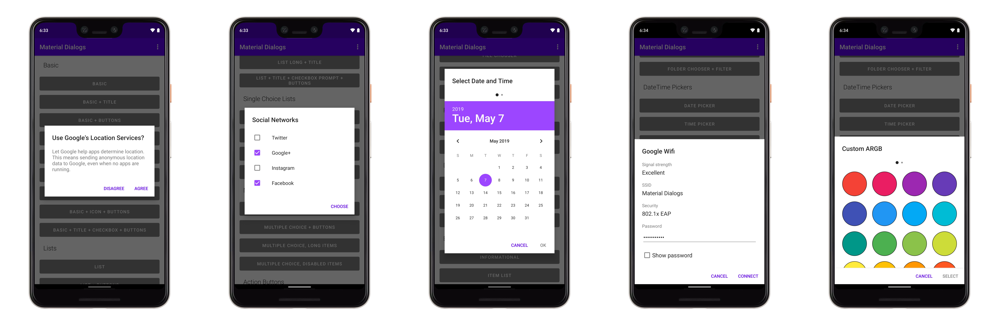
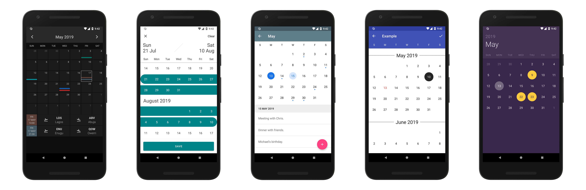
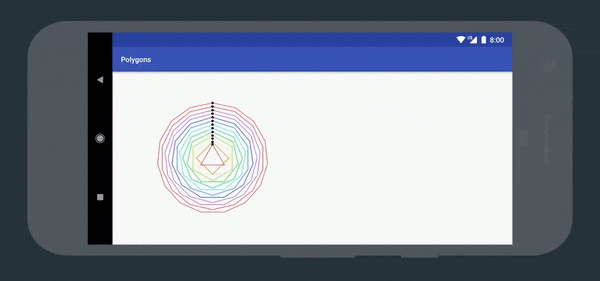
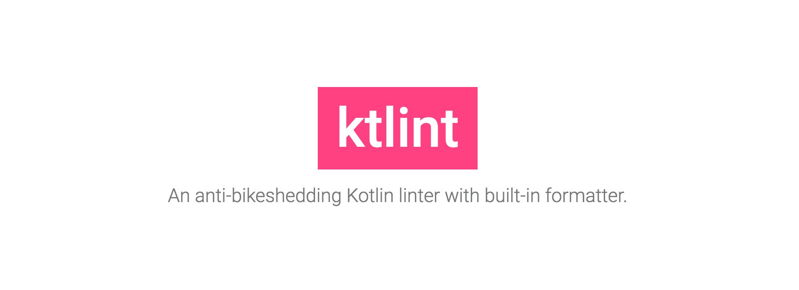
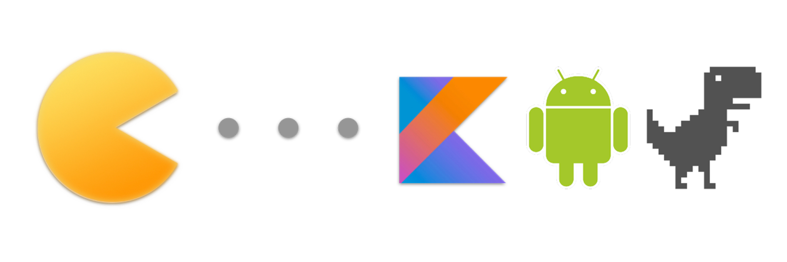

作者： [LeanCloud weakish](https://leancloud.cn/)

分享 2019 年 5 月 GitHub 上比较流行的 9 个和 Android 开发相关的开源项目，包括对话框、日历、矢量绘图组件，内存泄露检测库，Kotlin 的 linter、mock 库、依赖注入框架等。

## LeakCanary

square 开源的内存泄露检测库。


使用起来极为便捷，只需在 `build.gradle` 中引入依赖：

```groovy
dependencies {
  debugImplementation 'com.squareup.leakcanary:leakcanary-android:2.0-alpha-2'
}
```

LeakCanary 会自动检测 debug build 中的内存泄露，并显示提示。无需修改代码，也不会影响正式发布版本。

GitHub 仓库：[square/leakcanary](https://github.com/square/leakcanary/)

## Material Dialogs

美观、可扩展的 Material Design 风格对话框。



Material Dialogs 采用模块化架构，核心模块（`core`）包含了核心功能和基本功能，文本输入框、文件选择器、色彩选择器、时间日期选择器、弹出表单等功能作为扩展模块提供，可单独引入。支持 AndroidX 生命周期组件。

GitHub 仓库：[afollestad/material-dialogs](https://github.com/afollestad/material-dialogs)

## CalendarView

基于 RecyclerView 的日历库。



这个库借鉴了 iOS 的 [JTAppleCalendar]，提供了比较齐全的日历视图所需特性，支持定制样式。

[JTAppleCalendar]: https://github.com/patchthecode/JTAppleCalendar

GitHub 仓库：[kizitonwose/CalendarView](https://github.com/kizitonwose/CalendarView)

## Kyrie

`VectorDrawable` 和 `AnimatedVectorDrawable` 的超集。



`VectorDrawable` 提供了像素密度无关性——在任意设备上随意缩放而不损失画质。`AnimatedVectorDrawable` 在其基础上添加了动画特性。然而，它们有三大缺陷：

- 无法暂停和继续。
- 无法在运行时动态创建。
- 相比 web 上的 SVG，它们仅仅支持少量特性。

Kyrie 提供了 `KyrieDrawable` 类，支持 `VectorDrawable` 和 `AnimatedVectorDrawable` 的所有特性，同时改进了上述缺陷。

GitHub 仓库：[alexjlockwood/kyrie](https://github.com/alexjlockwood/kyrie)

## Assent

面向 Kotlin 和 AndroidX，让 Android 的运行时权限控制易于开发。

```kotlin
fun saveImage(bitmap: Bitmap) = runWithPermissions(WRITE_EXTERNAL_STORAGE) {
  val stream = FileOutputStream(File(externalStorage, "hello.png"))
  bitmap.compress(PNG, 100, stream)
}
```

上面的例子展示了 Assent 提供的简洁紧凑的基于回调的 API。（当然，你还是需要在 `AndroidManifest.xml` 里声明权限的，否则 Android 总会拒绝相应权限。）

GitHub 仓库：[afollestad/assent](https://github.com/afollestad/assent)

## ktlint

开箱即用的 Kotlin linter：

- 零配置。采用官方风格（[kotlinlang.org] 和 [Android Kotlin 风格指南]）。
- 内置格式化功能，类似 Go 语言的 `gofmt`。
- 单一可执行 jar 文件，内置所有依赖（当然，你还是需要自备 jvm 的）。
- 可搭配 maven、gradle、GNU Emacs、Vim 使用。



注意「零配置」的意思是并不提供多种风格选项让你选择，但是你仍然可以通过自行编写规则来自定义 linter 的行为。另外，ktlint 也会遵循 `.editorconfig` 中的设置。

ktlint 也可搭配 IntelliJ IDEA 使用。不过通常没有这个必要，可以直接使用 IDEA 内置的代码格式化功能（效果和 ktlint 一致）。暂时也没有 vscode 插件，不过可以通过 [sonarlint] 曲线使用。

[kotlinlang.org]: https://kotlinlang.org/docs/reference/coding-conventions.html
[Android Kotlin 风格指南]: https://android.github.io/kotlin-guides/style.html
[sonarlint]: https://www.sonarlint.org/ 

官网：[ktlint.github.io](https://ktlint.github.io/)

## mockk

Kotlin 的 mock 测试库，不仅支持常规的单元测试，还支持在真机或模拟器上运行的 instrumented 测试。


mockk 提供了全面、强大的特性，可以 mock 类、对象、私有函数、协程等多种结构（Android P 之前的版本 instrumented 测试有少数特性不支持）。

官网：[mockk.io](https://mockk.io/)

## KOIN

面向 Kotlin 开发者的轻量依赖注入框架。



KOIN 提供了轻量的函数式依赖注入 DSL，无需代码生成和反射。

```kotlin
class Controller(val service : BusinessService) 
class BusinessService()

val myModule = module { 
  single { Controller(get()) } 
  single { BusinessService() } 
}

class MyApplication : Application() {
  override fun onCreate(){
    super.onCreate()
    startKoin {
      androidContext(this@MyApplication)
      modules(myModule)
    }
  } 
}
```

官网：<https://insert-koin.io/>

## Firefox Fenix

Firefox Fenix 是 Firefox 的下一代 Android 浏览器，未来将取代 Firefox for Android （其实 Firefox for Android 的开发早已放缓，因为 Mozilla 将更多的精力投入到 Fenix 的开发中）。上个月，Mozilla 在 Google Player 上发布了[公测版]（仅向报名测试的人员开放下载）。

[公测版]: https://play.google.com/store/apps/details?id=org.mozilla.fenix

Firefox Fenix 基于 GeckoView 和 Android components 开发。[GeckoView] 是 Mozilla 开源的 Android 库，封装了自家的 Gecko 浏览器引擎。Android 上的 [Firefox Reality] （面向 AR 设备的浏览器）和 [Firefox Focus] （主打极简 UI 和隐私保护的浏览器）用的也是 GecokView。[Android components] 则是 Mozilla 使用 Kotlin 开发的一套 Android 组件库，这套组件库主要面向浏览器和类浏览器应用。顺便提一下，由于 Android components 使用 Kotlin 开发，Firefox Fenix 也顺理成章地使用 Kotlin 开发。

[GeckoView]: https://wiki.mozilla.org/Mobile/GeckoView
[Firefox Reality]: https://github.com/mozillareality/firefoxreality
[Firefox Focus]: https://github.com/mozilla-mobile/focus-android/
[Android components]: https://github.com/mozilla-mobile/android-components

GitHub 仓库：[mozilla-mobile/fenix](https://github.com/mozilla-mobile/fenix)

## 结语

上月初召开的 Google I/O 2019，宣布 Kotlin 为 Android 开发的首选语言，未来新的 Jetpack API 和特性将首先提供 Kotlin 支持，并建议新项目使用 Kotlin 编写。很巧，上面介绍的 9 个开源项目，均使用 Kotlin 编写。当然，其中不少是专门面向 Kotlin 的辅助开发工具，使用 Kotlin 编写理所当然。但是几款 Android 组件库均使用 Kotlin 编写（本文选取项目时仅考虑 GitHub 上的热度（蹿升速度），不考虑编写语言为 Java 还是 Kotlin），Firefox 下一代浏览器基于 Kotlin 开发，LeakCanary 上个月发布了 v2.0-alpha-2，2.0 版的一大改动就是使用 Kotlin 重写，这些事实多多少少能从侧面反映，Android 生态的重心正向 Kotlin 偏移。

题图：[Stephen Frank](https://unsplash.com/photos/MGuxRnjniuU)