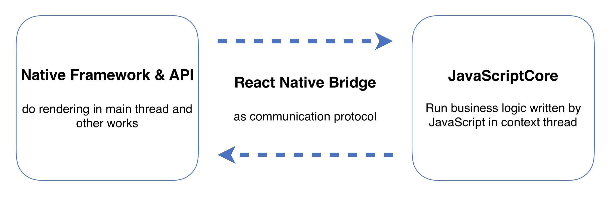
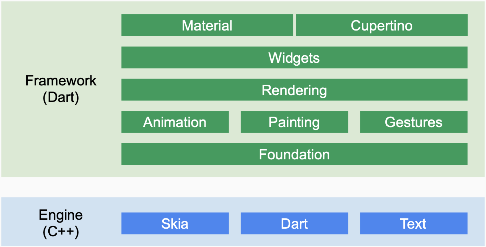

作者：[LeanCloud 郑鹏](https://github.com/zapcannon87)

2018 年 12 月，Google 发布了 Flutter 1.0 正式版，似乎再次点燃了人们对移动跨平台开发的热情。上一次出现类似的情况，是在 15 年年初，Facebook 发布 React Native 的时候。四年不到的时间里，有两家大公司相继推出了自己的移动跨平台方案（当然还有 16 年的时候，微软收购了 Xamarin，不过没有前两个那么引人注目罢了），同时这些方案也受到了市场的追逐。这些现象，似乎预示着，跨平台开发才是移动开发的未来，或者说，跨平台开发才是一种更好的开发方式。

既然它是热点，那肯定有可以讨论的地方。不过，在说 React Native 和 Flutter 之前，我觉得要先谈一谈「跨平台开发」。

## 移动跨平台方案

那什么是「跨平台开发」呢？

通常意义上来说，如果你想在 iOS 以及 Android 系统里，提供有相同内容的 App，那么使用 Apple 提供的构建工具，开发一个 App，然后上架到 AppStore，同时使用 Google 提供的构建工具，开发一个 App，然后上架到 Google Play。这两个 App 的实现，除了使用的工具不同之外，大部分业务逻辑是相同的。你可以发现，在这个过程中，产生了「重复」。

在重构时，如果项目里有大量的重复代码，或者重复逻辑，我们一般会将这些代码或逻辑以函数，模块或库的形式做封装，这个过程最大化的消除了重复的代码，最终达到简化项目的代码这一目的。

所以在我看来，「跨平台开发」也是基于这个思想而产生的，人们想要一套减少甚至不用写重复逻辑的解决方案，然后市场给予了人们期望的方案。跨平台方案的最大特点，可以用 Sun 当年在推广 Java 时，所使用的一句口号：”Write once, run anywhere” 作为总结。这一句话，也被如今的 React Native 以及 Flutter 引用或继承。

## React Native

React Native 是由 Facebook 所主导的跨平台方案，得益于 Javascript 以及 ReactJS 的流行，React Native 在推出时，便受到了大量的追捧。除了跨平台的特性，React Native 最大的特点就是，可以使用 Javascript 来构建移动应用，并且最终应用的表现形式，可以做到和使用原生开发套件开发的应用相差无几。

React Native 能做到这些的核心原理就是 JavaScriptCore，一个 JavaScript 虚拟机。通过 JavaScriptCore，Javascript 能和其它语言互相转义，同时 JavaScriptCore 能运行在 iOS，Android 以及其它平台上，这些可能性放在一起，就成为了 React Native 的基底。有了这个基底之后，Facebook 便在这个基础之上，封装了各平台的应用层接口，定义了 Javascript 和封装后的接口之间的通信协议，最终，实现了使用 JavaScript 在不同平台开发具有原生体验的应用。

从实现原理以及架构上来看，React Native 似乎是一个不错的跨平台方案，只要封装好各平台的 API，那么我们有理由去相信，人们能够使用 React Native 开发出品质优秀的应用。但是事实上，理想和现实，还是有差距的。在 18 年，[AirBnB](https://medium.com/airbnb-engineering/react-native-at-airbnb-f95aa460be1c) 以及 [Udacity](https://engineering.udacity.com/react-native-a-retrospective-from-the-mobile-engineering-team-at-udacity-89975d6a8102) 相继发表了博文，声明全面放弃 React Native，转向原生应用的开发。他们在文章中，提到的最多的就是，React Native 是一个不成熟的方案，虽然它有许许多多的优点，但是这些并不足以去弥补它的缺点带来的损失。AirBnB 以及 Udacity 可能是因为各种预期的理由而放弃了 React Native，不过在我看到 Discord 团队发表的 [Why Discord is Sticking with React Native](https://blog.discordapp.com/why-discord-is-sticking-with-react-native-ccc34be0d427) 博文后，算是彻底打消了我在生产环境使用 React Native 的念头。整篇文章看下来，让 Discord 团队仍然继续使用 React Native 的最大原因，似乎就是项目已经使用了它，骑虎难下了。

JavaScriptCore 的局限性，Facebook 在项目管理上的不成熟，以及不断出现的放弃声明，最终让人们发现，React Native 是一个有趣的方案，但并不是一个成熟稳定的方案。

## Flutter

就在 React Native 的人气不断下跌的时候，Google 在一个恰到好处的时机，推出了一套跨平台方案：Flutter，将人们的目光再次聚集到跨平台开发上面。

Flutter 使用 Dart 这门较为冷门的语言来做开发，底基引擎主要由 Skia 和 Dart runtime 构成。Flutter 通过 Skia 和各平台的底层图形库对接，同时提供丰富的基于 Skia 的控件，来实现跨平台的开发。React Native 采用的方式是封装各个平台的应用层接口，而 Flutter 则直接打造了一套跨平台的应用层的开发套件。对这两种不同的方式，我们可以有一个直觉上的判断，Flutter 在性能上是要优于 React Native 的。因为 Flutter 的这种实现方式，其实早已被大量并广泛的使用了，最明显的例子就是游戏引擎。

种种对比和迹象表明，似乎 Flutter 是一个比 React Native 更好的跨平台方案。目前 Flutter 仍旧处于一个上升的势头，也有如阿里巴巴这种大厂给 Flutter 背书，颇具野心的底基框架让开发者有理由相信，只要投入足够的人力，Flutter 可以做到和原生开发一样好。

然而，Flutter 的缺点，也是源于它自行打造了框架，在很多平台特性上，诸如密码管理，选择光标等，Flutter 目前并不能支持，未来能否支持也要打上大大的问号，平台的特性可能和原生组件深度绑定，且目前没有其它接口，所以 Flutter 在现在这种状态下，只能是放弃这些特性的支持。需要提一点的是，React Native 在这方面没有太大的问题。

尽管有一些问题，不过 Flutter 表现出的潜力，还是让人们觉得，这是一个值得一试的方案，只要 Google 给予足够的支持。所以 Google 会吗？

## 结语

那么，我该选择哪种方案呢？答案：It depends on you.

事实上就是，没有一个一而全的方案，任何方案都有利弊和取舍。想使用 Javascript 开发应用，那么就使用 React Native；想构建高性能的跨平台应用，Flutter 是个不错的选择；想最大化平台特性，那自然是原生的开发方式。

除了跨平台方案之间的比较之外，跨平台方案也在和原生开发方式竞争，而且这种竞争往往是不平等的，跨平台方案在新特性的支持上，始终要慢于原生开发方式，所以在市场占有率方面，原生开发方式就有天然的先发优势，这种差距很难被抹平。最终，你可能会发现，也许原生开发方式才是最合适的，因为除了「重复」外，原生开发方式相比跨平台方案，没有其它缺点了。

附记：之前我在 2019 年 3 月的 RTC Dev Meetup 北京站交流过上面的想法，感兴趣的读者可以查看[演讲视频][video]和 [slide](slides/RTCmeetup.pdf)。

[video]: https://www.bilibili.com/video/av47506078/

题图：[Chris Sabor](https://unsplash.com/photos/qlaot0VrqTM)