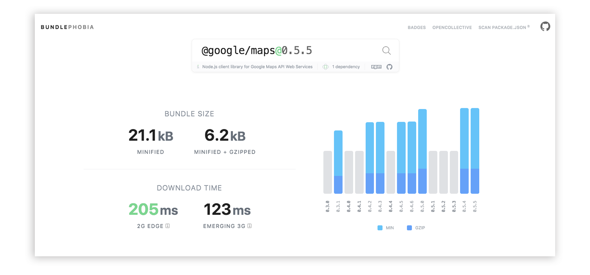
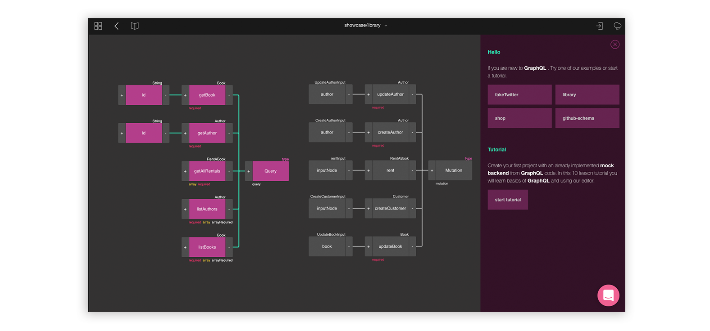
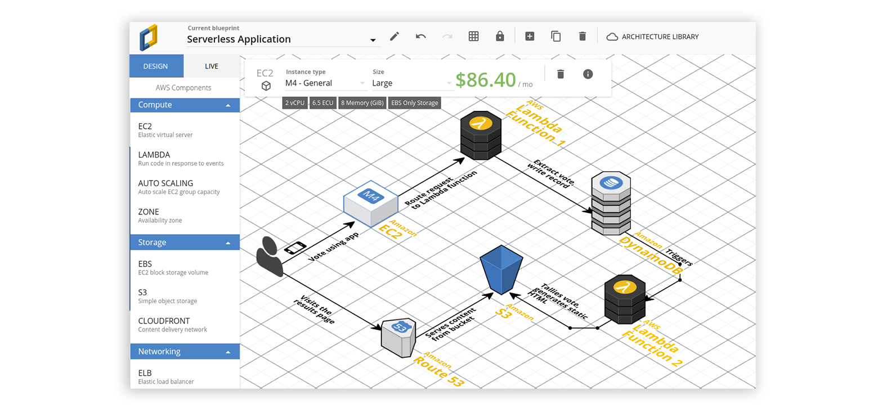
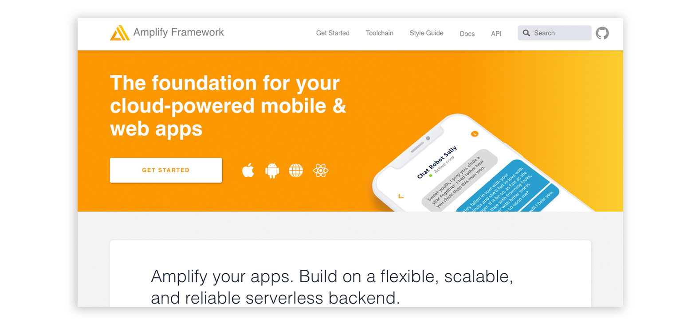
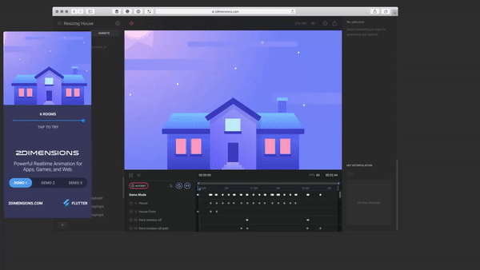

[Tomek Poniatowicz] 原作，授权 [New Frontend](https://nextfe.com/) 翻译。

[Tomek Poniatowicz]: https://dev.to/tomekponiat/5-developer-tools-you-need-to-check-out-34k0

将普通开发人员与优秀开发人员区分开来的一个原因是不断渴望学习和采用可以简化生活的新工具。这里列出了五个很酷的工具，帮助你的生活:)

## BundlePhobia

> **bundle phobia**

> /ˈbʌnd(ə)l fəʊbɪə/
> 对你的捆绑包添加新的 npm 包可能带来后果的非理性恐惧。

如果您一直担心在项目中添加一个 npm 包会摧毁你的项目，那这个工具对您将会非常有用。BundlePhobia 可让您在将 npm 包实际添加到项目之前了解 `npm install` 任何包的性能成本。

## GraphQL 编辑器
GraphQL 是一种用于 API 的查询语言，它显示了服务器提供的数据类型，然后客户端可以在一次调用中准确地获取它所需的内容，而不是进行多次 REST API 调用。模式是任何 GraphQL 项目的关键部分，GraphQL Editor 使得构建或理解现有 GraphQL 模式变得更加容易，您可以通过链接的可视节点来规划它。从 URL/文件加载模式或伪造的后端数据等功能可以大大加快应用程序的原型设计！

## CloudCraft
CloudCraft 是一个非常美好的工具,可让您立即进行云端架构设计。此工具可以用图形表示各种 AWS 服务并计算服务成本。想想是不是很酷？

## Amplify Framework
想要构建一个云基础应用程序？这是您需要的唯一工具！AWS 的 Amplify Framework 是一个用于构建功能齐全的应用程序的库！该框架允许您轻松连接微服务：

- API
- Analytics（分析）
- 认证
- 通知
- 存储

不止这些！Amplify 还提供各种漂亮的开箱即用 UI 组件，随时准备将您的应用程序提升到新的水平！

## Flare
Flare 是一款功能强大的设计和动画工具，可让设计人员和开发人员轻松地为他们的应用和游戏添加高质量的动画。使用 Flare，您可以创建：

- 复杂的互动
- 动画图标
- 登录页面
- 游戏角色

这些是在您的应用程序中运行的真实设计资产 - 它们不需要在代码中重新创建！这使得未来的修改非常容易！

