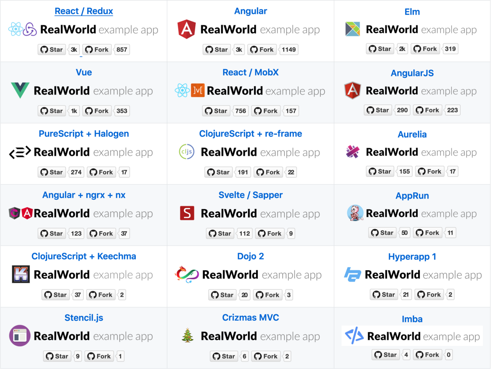

[Jacek Schae] 原作，授权 [LeanCloud](https://leancloud.cn/) 翻译。

[Jacek Schae]: https://medium.freecodecamp.org/a-realworld-comparison-of-front-end-frameworks-with-benchmarks-2019-update-4be0d3c78075

我们将基于 [RealWorld 示例应用][RealWorld]对比前端框架。RealWorld 示例应用的特点：

[RealWorld]: https://github.com/gothinkster/realworld

- RealWorld 应用

    比待办事项类应用更复杂。通常待办事项类应用不足以传达足够多的知识见解构建**实际**应用。

- 标准化

    项目遵循特定规则。提供后端 API、静态标记语言、风格、API 规范。

- 专业人士编写、审阅

    理想情况下，会是高一致性、高真实度的项目，由使用该技术的专业人士编写或审阅。

## 比较的库和框架

撰写本文时，[RealWorld 示例应用][RealWorld]仓库共包括 18 个 Conduit （Medium.com 克隆应用）实现。

本文不考虑框架的流行程度，RealWorld 仓库中列出的前端框架皆纳入对比范围。

## 测度

### 性能

应用显示内容、可以使用需要花多久？

### 尺寸

应用有多大？我们只比较编译后的 JavaScript 文件大小。所有应用使用同样的 CSS 样式文件，CSS 文件加载自 CDN。所有应用使用的 HTML 也是一样的。这些框架都支持编译或转换为 JavaScript，所以我们仅仅测量 JavaScript 文件大小。

### 代码行数

根据规范创建 RealWorld 应用需要多少行代码？公平地说，某些实现的功能要略微多一点，但这应该没有什么显著的影响。我们仅仅测量每个应用的 `src/` 目录。

## 性能

我们将使用 Chrome 的 [Lighthouse Audit] 测试性能。Lighthouse 返回 0 至 100 间的评分。0 为最低分。

[Lighthouse Audit]: https://developers.google.com/web/tools/lighthouse/

### 配置

所有测试均使用如下配置：

性能评分基于以下测度得出：

- First Contentful Paint （页面中内容元素首次渲染时间）
- First Meaningful Paint （页面中有意义的内容元素首次渲染时间）
- Speed Index （页面加载过程视觉上的变化速度）
- First CPU Idle （到 CPU 首次空闲的时间）
- Time to Interactive　（到页面可交互的时间）
- Estimated Input Latency （预计输入延迟）

详见 [Lighthouse 评分指南][lighthouse-scoring]。

[lighthouse-scoring]: https://developers.google.com/web/tools/lighthouse/v3/scoring

### TL;DR

首次渲染越快，到可以进行操作的时间越短，应用的用户体验就越好。

注意：我们跳过了 PureScript，因为它没有 Demo 应用。

### 结论

大部分应用的评分超过 90。所以，用户大概感觉不到这些框架的性能有什么大差别。

## 尺寸

传输尺寸根据 Chrome 开发者工具的网络标签页统计，包括服务器送达的响应头和响应体（经过 GZIP 压缩）。

这取决于框架的尺寸以及额外依赖的尺寸，还有构建工具精简未使用代码的效率。

### TL;DR

文件越小，下载越快，需要解析的内容越少。（下图中的单位为 KB。）

### 结论

这方面有不少惊人的结果。Svelte，魔法消失 UI 框架，无愧其名。Stencil 是一个比较新的框架，表现优异。这两个框架相对而言都比较新，将尺寸推向了新的极限。

## 代码行数

我们使用 [cloc] 计算每个仓库的 src 目录的代码行数，不计空行和注释。为什么要比较代码行数？这是因为：

[cloc]: https://github.com/AlDanial/cloc

> 如果说调试是移除软件 bug 的过程，那么编程一定是植入 bug 的过程。
>
> Edsger Dijkstra

### TL;DR

下面的图表显示了给定的库/框架/语言有多凝练。根据规范实现几乎完全一样的应用（某些应用功能略多一点）需要多少行代码。

注意：我们跳过了 Imba，因为 [cloc] 无法处理 `.imba` 文件。Elm 开发者写代码喜欢分行，所以行数较多（至少[别人是这么告诉我的][vertical-elm]）。Angular+ngrx 只计算了 `libs` 目录中的 `.ts` 和 `.html` 文件，如果你认为这么算不对，请告诉我正确的数字及其计算方法。本文刚发表时 Hyperapp 的代码行数计算有误，感谢 [Mateusz Kwasniewski] 指出正确的代码行数。

[vertical-elm]: https://twitter.com/rtfeldman/status/983384187116949505
[Mateusz Kwasniewski]: https://twitter.com/kwasniew

### 结论

就代码行数而言，使用 ClojureScript 的 re-frame 给出了炸裂💥的结果。Clojure 以异常高的表达力而闻名。如果你在乎代码行数，应该了解下 ClojureScript、AppRun、Svelte。

## 总结

别忘了这并不是一个精确公平的对比。有些实现分离了代码，有些没有。有些部署在 GitHub 上，有些部署在 Now 上，有些部署在 Netlify 上。如果你仍然要问哪个最好？我只能说，最好的框架是最符合你需求的那个。

**Q:** 偏爱强类型检查？ 
**A:** 了解下 Elm、PureScript、TypeScript —— Angular、AppRun、Dojo.

**Q:** 想要一个非常轻量的框架？ 
**A:** 了解下 Svelte、Stencil、AppRun.

**Q:** 想维护尽可能少的代码？ 
**A:** 了解下 re-frame（使用 ClojureScript）、AppRun、Svelte.

**Q:** 想要学点新的？ 
**A:** 选择你不了解的框架！

## FAQ

### 1. 为什么不对比框架 X、Y、Z？

因为 [RealWorld 仓库][RealWorld] 中的实现不完整。考虑下贡献代码！用你最喜欢的库/框架实现一下，我们会在下次对比中包含它们！

### 2. 为什么称它为 RealWorld？

因为它的功能要比 To-Do 应用复杂。RealWorld 并不意味着我们会对比薪资水平、维护水平、生产率、学习曲线等要素，有[其他调研][other surveys]回答了这些问题中的一部分。RealWorld 的意思是这个应用会像真实世界项目一样，连接一个服务器，认证用户，允许用户增删改查。

[other surveys]: https://insights.stackoverflow.com/survey/2018/

### 3. 你为什么没纳入我最喜欢的框架？

请回过头去看看上文的第一问。不过我这里还是想强调下：因为 [RealWorld 仓库][RealWorld] 中的实现不完整。这些实现是社区共同努力的结果，而非我一人所为。如果你想在对比中看到自己最喜欢的框架，考虑下贡献代码。

### 4. 对比的是哪个版本的库/框架？

本文撰写时（2019 年 3 月）可用的版本。详见 [RealWorld 仓库][RealWorld]。

### 5. 为什么没有对比某个流行得多的框架？

再一次，看看前面的问题。很简单，[RealWorld 仓库][RealWorld] 中的实现不完整。

感谢 [Rich Harris] 和 [Richard Feldman] 在发表前审阅本文。

[Rich Harris]: https://twitter.com/Rich_Harris
[Richard Feldman]: https://twitter.com/rtfeldman

如果你喜欢这篇文章，可以[在 Twitter 上关注我][twitter]。我只发编程、技术方面的推。

[twitter]: https://twitter.com/JacekSchae

译者注：实现上的种种差异（比如 Vue 是否搭配 Vuex）及其他因素对结果会有很大影响，因此图表仅供参考，并不能准确地体现框架的高下。况且，框架的选型涉及众多因素，大多数场景下，有许多因素的权重远高于性能、尺寸、代码行数。所以，正如原文所说，最好的框架是最符合需求的那个。