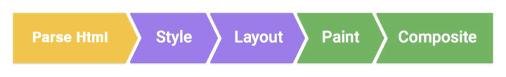
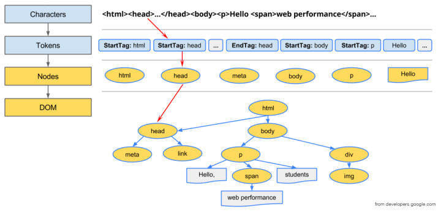
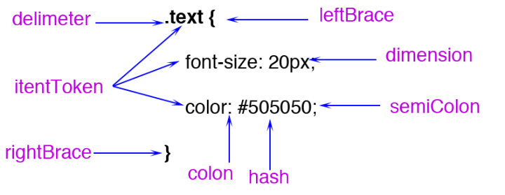
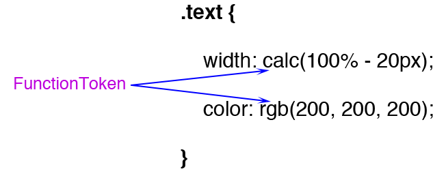
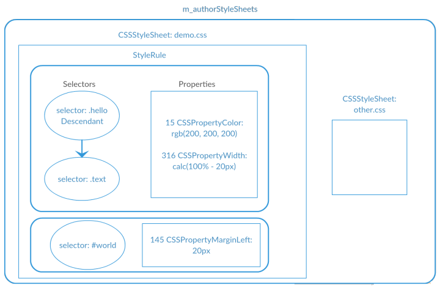
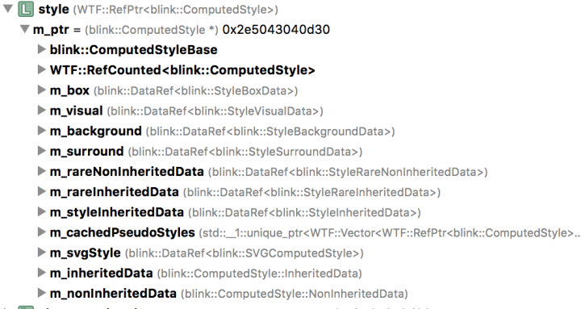
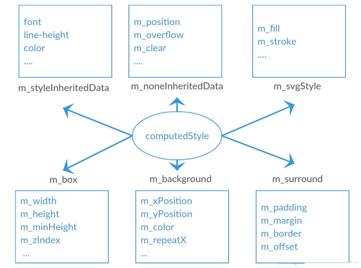
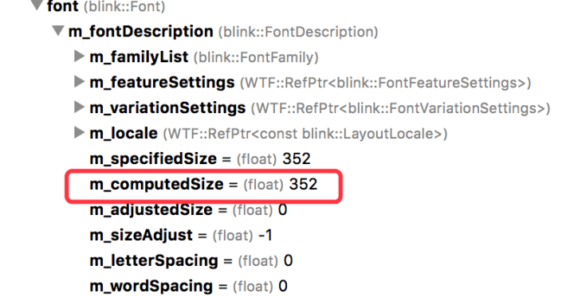

作者[李银城]，授权[新前端]转载

[李银城]: https://zhuanlan.zhihu.com/p/25380611
[新前端]: https://nextfe.com/

在[《Effective前端6：避免页面卡顿》][avoid-junk]这篇里面介绍了浏览器渲染页面的过程：



[avoid-junk]: https://zhuanlan.zhihu.com/p/25166666

并且[《从Chrome源码看浏览器如何构建DOM树》][chrome-build-dom]介绍了第一步如何解析Html构建DOM树，这个过程大概如下：

[chrome-build-dom]: https://link.zhihu.com/?target=http%3A//fed.renren.com/2017/01/30/chrome-build-dom/



浏览器每收到一段html的文本之后，就会把它序列化成一个个的tokens，依次遍历这些token，实例化成对应的html结点并插入到DOM树里面。

我将在这一篇介绍第二步Style的过程，即CSS的处理。

## 1. 加载CSS

在构建DOM的过程中，如果遇到link的标签，当把它插到DOM里面之后，就会触发资源加载——根据href指明的链接：

```html
<link rel="stylesheet" href="demo.css">
```

上面的rel指明了它是一个样式文件。这个加载是异步，不会影响DOM树的构建，只是说在CSS没处理好之前，构建好的DOM并不会显示出来。用以下的html和css做试验：

```html
<!DOCType html>
<html>
<head>
    <link rel="stylesheet" href="demo.css">
</head>
<body>
<div class="text">
    <p>hello, world</p>
</div>
</body>
```

demo.css如下：

```css
.text{
    font-size: 20px;
}
.text p{
    color: #505050;
}
```

从打印的log可以看出(添加打印的源码略)：

```
[DocumentLoader.cpp(558)] “<!DOCType html>\n<html>\n<head>\n<link rel=\”stylesheet\” href=\”demo.css\”> \n</head>\n<body>\n<div class=\”text\”>\n <p>hello, world</p>\n</div>\n</body>\n</html>\n”
[HTMLDocumentParser.cpp(765)] “tagName: html |type: DOCTYPE|attr: |text: “
[HTMLDocumentParser.cpp(765)] “tagName: |type: Character |attr: |text: \n”
[HTMLDocumentParser.cpp(765)] “tagName: html |type: startTag |attr: |text: “
…
[HTMLDocumentParser.cpp(765)] “tagName: html |type: EndTag |attr: |text: “
[HTMLDocumentParser.cpp(765)] “tagName: |type: EndOfFile|attr: |text: “
[Document.cpp(1231)] readystatechange to Interactive
[CSSParserImpl.cpp(217)] recieved and parsing stylesheet: “.text{\n font-size: 20px;\n}\n.text p{\n color: #505050;\n}\n”
```

在CSS没有加载好之前，DOM树已经构建好了。为什么DOM构建好了不把html放出来，因为没有样式的html直接放出来，给人看到的页面将会是乱的。所以CSS不能太大，页面一打开将会停留较长时间的白屏，所以把图片/字体等转成base64放到CSS里面是一种不太推荐的做法。

## 2. 解析CSS

### （1）字符串 -> tokens

CSS解析和html解析有比较像的地方，都是先格式化成tokens。CSS token定义了很多种类型，如下的CSS会被拆成这么多个token：



经常看到有人建议CSS的色值使用16位的数字会优于使用rgb的表示，这个是子虚乌有，还是有根据的呢？

如下所示：



如果改成rgb，它将变成一个函数类型的token，这个函数需要再计算一下。从这里看的话，使用16位色值确实比使用rgb好。

### tokens -> styleRule

这里不关心它是怎么把tokens转化成style的规则的，我们只要看格式化后的styleRule是怎么样的就可以。每个styleRule主要包含两个部分，一个是选择器selectors，第二个是属性集properties。用以下CSS：

```css
.text .hello{
    color: rgb(200, 200, 200);
    width: calc(100% - 20px);
}
 
#world{
    margin: 20px;
}
```

打印出来的选择器结果为（相关打印代码省略）：

```
selector text = “.text .hello”
value = “hello” matchType = “Class” relation = “Descendant”
tag history selector text = “.text”
value = “text” matchType = “Class” relation = “SubSelector”
selector text = “#world”
value = “world” matchType = “Id” relation = “SubSelector”
```

从第一个选择器可以看出，它的解析是从右往左的，这个在判断match的时候比较有用。

blink定义了几种matchType：

```cpp
enum MatchType {
    Unknown,
    Tag,               // Example: div
    Id,                // Example: #id
    Class,             // example: .class
    PseudoClass,       // Example:  :nth-child(2)
    PseudoElement,     // Example: ::first-line
    PagePseudoClass,   // ??
    AttributeExact,    // Example: E[foo="bar"]
    AttributeSet,      // Example: E[foo]
    AttributeHyphen,   // Example: E[foo|="bar"]
    AttributeList,     // Example: E[foo~="bar"]
    AttributeContain,  // css3: E[foo*="bar"]
    AttributeBegin,    // css3: E[foo^="bar"]
    AttributeEnd,      // css3: E[foo$="bar"]
    FirstAttributeSelectorMatch = AttributeExact,
  };
```

还定义了几种选择器的类型：

```cpp
enum RelationType {
    SubSelector,       // No combinator
    Descendant,        // "Space" combinator
    Child,             // > combinator
    DirectAdjacent,    // + combinator
    IndirectAdjacent,  // ~ combinator
    // Special cases for shadow DOM related selectors.
    ShadowPiercingDescendant,  // >>> combinator
    ShadowDeep,                // /deep/ combinator
    ShadowPseudo,              // ::shadow pseudo element
    ShadowSlot                 // ::slotted() pseudo element
  };
```

.text .hello的.hello选择器的类型就是Descendant，即后代选择器。记录选择器类型的作用是协助判断当前元素是否match这个选择器。例如，由于.hello是一个父代选器，所以它从右往左的下一个选择器就是它的父选择器，于是判断当前元素的所有父元素是否匹配.text这个选择器。

第二个部分——属性打印出来是这样的：

```
selector text = “.text .hello”
perperty id = 15 value = “rgb(200, 200, 200)”
perperty id = 316 value = “calc(100% – 20px)”
selector text = “#world”
perperty id = 147 value = “20px”
perperty id = 146 value = “20px”
perperty id = 144 value = “20px”
perperty id = 145 value = “20px”
```

所有的CSS的属性都是用id标志的，上面的id依次对应：

```cpp
enum CSSPropertyID {
    CSSPropertyColor = 15,
    CSSPropertyWidth = 316,
    CSSPropertyMarginLeft = 145,
    CSSPropertyMarginRight = 146,
    CSSPropertyMarginTop = 147,
    CSSPropertyMarkerEnd = 148,
}
```

设置了margin: 20px，会转化成四个属性。从这里可以看出CSS提倡属性合并，但是最后还是会被拆成各个小属性。所以属性合并最大的作用应该在于减少CSS的代码量。

一个选择器和一个属性集就构成一条rule，同一个css表的所有rule放到同一个stylesheet对象里面，blink会把用户的样式存放到一个m_authorStyleSheets的向量里面，如下图示意：



除了autherStyleSheet，还有浏览器默认的样式DefaultStyleSheet，这里面有几张，最常见的是UAStyleSheet，其它的还有svg和全屏的默认样式表。Blink ua全部样式可见这个文件[html.css]，这里面有一些常见的设置，如把style/link/script等标签display: none，把div/h1/p等标签display: block，设置p/h1/h2等标签的margin值等，从这个样式表还可以看到Chrome已经支持了HTML5.1新加的标签，如dialog：

[html.css]: https://www.yinchengli.com/html/chrome-ua-css.html

```css
dialog {
  position: absolute;
  left: 0;
  right: 0;
  width: -webkit-fit-content;
  height: -webkit-fit-content;
  margin: auto;
  border: solid;
  padding: 1em;
  background: white;
  color: black;
}
```

另外还有怪异模式的样式表：quirk.css，这个文件很小，影响比较大的主要是下面：

[quirk.css]: https://www.yinchengli.com/html/chrome-quirk.css.html

```css
/* This will apply only to text fields, since all other inputs already use border box sizing */
input:not([type=image i]), textarea {
    box-sizing: border-box;
}
```

blink会先去加载html.css文件，怪异模式下再接着加载quirk.css文件。

### 生成哈希map

最后会把生成的rule集放到四个类型哈希map：

```cpp
CompactRuleMap m_idRules;
CompactRuleMap m_classRules;
CompactRuleMap m_tagRules;
CompactRuleMap m_shadowPseudoElementRules;
```

map的类型是根据最右边的selector的类型：id、class、标签、伪类选择器区分的，这样做的目的是为了在比较的时候能够很快地取出匹配第一个选择器的所有rule，然后每条rule再检查它的下一个selector是否匹配当前元素。

## 3. 计算CSS

CSS表解析好之后，会触发layout tree，进行layout的时候，会把每个可视的Node结点相应地创建一个Layout结点，而创建Layout结点的时候需要计算一下得到它的style。为什么需要计算style，因为可能会有多个选择器的样式命中了它，所以需要把几个选择器的样式属性综合在一起，以及继承父元素的属性以及UA的提供的属性。这个过程包括两步：找到命中的选择器和设置样式。

### （1）选择器命中判断

用以下html做为demo：

```html
<style>
.text{
    font-size: 22em;
}
.text p{
    color: #505050;
}
</style>
<div class="text">
    <p>hello, world</p>
</div>
```

上面会生成两个rule，第一个rule会放到上面提到的四个哈希map其中的classRules里面，而第二个rule会放到tagRules里面。

当这个样式表解析好时，触发layout，这个layout会更新所有的DOM元素：

```cpp
void ContainerNode::attachLayoutTree(const AttachContext& context) {
  for (Node* child = firstChild(); child; child = child->nextSibling()) {
    if (child->needsAttach())
      child->attachLayoutTree(childrenContext);
  }
}
```

这是一个递归，初始为document对象，即从document开始深度优先，遍历所有的dom结点，更新它们的布局。

对每个node，代码里面会依次按照id、class、伪元素、标签的顺序取出所有的selector，进行比较判断，最后是通配符，如下：

```cpp
//如果结点有id属性
if (element.hasID()) 
  collectMatchingRulesForList(
      matchRequest.ruleSet->idRules(element.idForStyleResolution()),
      cascadeOrder, matchRequest);
//如果结点有class属性
if (element.isStyledElement() && element.hasClass()) { 
  for (size_t i = 0; i < element.classNames().size(); ++i)
    collectMatchingRulesForList(
        matchRequest.ruleSet->classRules(element.classNames()[i]),
        cascadeOrder, matchRequest);
}
//伪类的处理
...
//标签选择器处理
collectMatchingRulesForList(
    matchRequest.ruleSet->tagRules(element.localNameForSelectorMatching()),
    cascadeOrder, matchRequest);
//最后是通配符
...
```

在遇到div.text这个元素的时候，会去执行上面代码的取出classRules的那行。

上面domo的rule只有两个，一个是classRule，一个是tagRule。所以会对取出来的这个classRule进行检验：

```cpp
if (!checkOne(context, subResult))
  return SelectorFailsLocally;
if (context.selector->isLastInTagHistory()) { 
    return SelectorMatches;
}
```

第一行先对当前选择器(.text)进行检验，如果不通过，则直接返回不匹配，如果通过了，第三行判断当前选择器是不是最左边的选择器，如果是的话，则返回匹配成功。如果左边还有限定的话，那么再递归检查左边的选择器是否匹配。

我们先来看一下第一行的checkOne是怎么检验的：

```cpp
switch (selector.match()) { 
  case CSSSelector::Tag:
    return matchesTagName(element, selector.tagQName());
  case CSSSelector::Class:
    return element.hasClass() &&
           element.classNames().contains(selector.value());
  case CSSSelector::Id:
    return element.hasID() &&
           element.idForStyleResolution() == selector.value();
}
```

很明显，.text将会在上面第6行匹配成功，并且它左边没有限定了，所以返回匹配成功。

到了检验p标签的时候，会取出”.text p”的rule，它的第一个选择器是p，将会在上面代码的第3行判断成立。但由于它前面还有限定，于是它还得继续检验前面的限定成不成立。

前一个选择器的检验关键是靠当前选择器和它的关系，上面提到的relationType，这里的p的relationType是Descendant即后代。上面在调了checkOne成功之后，继续往下走：

```cpp
switch (relation) { 
  case CSSSelector::Descendant:
    for (nextContext.element = parentElement(context); nextContext.element;
         nextContext.element = parentElement(nextContext)) { 
      MatchStatus match = matchSelector(nextContext, result);
      if (match == SelectorMatches || match == SelectorFailsCompletely)
        return match;
      if (nextSelectorExceedsScope(nextContext))
        return SelectorFailsCompletely;
    } 
    return SelectorFailsCompletely;
      case CSSSelector::Child:
    //...
}
```

由于这里是一个后代选择器，所以它会循环当前元素所有父结点，用这个父结点和第二个选择器”.text”再执行checkOne的逻辑，checkOne将返回成功，并且它已经是最后一个选择器了，所以判断结束，返回成功匹配。

后代选择器会去查找它的父结点 ，而其它的relationType会相应地去查找关联的元素。

所以不提倡把选择器写得太长，特别是用sass/less写的时候，新手很容易写嵌套很多层，这样会增加查找匹配的负担。例如上面，它需要对下一个父代选器启动一个新的递归的过程，而递归是一种比较耗时的操作。一般是不要超过三层。

上面已经较完整地介绍了匹配的过程，接下来分析匹配之后又是如何设置style的。

### 设置style

```cpp
style->inheritFrom(*state.parentStyle())
matchUARules(collector);
matchAuthorRules(*state.element(), collector);
```

每一步如果有styleRule匹配成功的话会把它放到当前元素的m_matchedRules的向量里面，并会去计算它的优先级，记录到m_specificity变量。这个优先级是怎么算的呢？

```cpp
for (const CSSSelector* selector = this; selector;
     selector = selector->tagHistory()) { 
  temp = total + selector->specificityForOneSelector();
}
return total;
```

如上代码所示，它会从右到左取每个selector的优先级之和。不同类型的selector的优级级定义如下：

```cpp
switch (m_match) {
    case Id: 
      return 0x010000;
    case PseudoClass:
      return 0x000100;
    case Class:
    case PseudoElement:
    case AttributeExact:
    case AttributeSet:
    case AttributeList:
    case AttributeHyphen:
    case AttributeContain:
    case AttributeBegin:
    case AttributeEnd:
      return 0x000100;
    case Tag:
      return 0x000001;
    case Unknown:
      return 0;
  }
  return 0;
}
```

其中id的优先级为0x10000 = 65536，类、属性、伪类的优先级为0x100 = 256，标签选择器的优先级为1。如下面计算所示：

```css
/*优先级为257 = 265 + 1*/
.text h1{
    font-size: 8em;
}
 
/*优先级为65537 = 65536 + 1*/
#my-text h1{
    font-size: 16em;
}
```

内联style的优先级又是怎么处理的呢？

当match完了当前元素的所有CSS规则，全部放到了collector的m_matchedRules里面，再把这个向量根据优先级从小到大排序：

```cpp
collector.sortAndTransferMatchedRules();
```

排序的规则是这样的：

```cpp
static inline bool compareRules(const MatchedRule& matchedRule1,
                                const MatchedRule& matchedRule2) {
  unsigned specificity1 = matchedRule1.specificity();
  unsigned specificity2 = matchedRule2.specificity();
  if (specificity1 != specificity2)
    return specificity1 < specificity2;
 
  return matchedRule1.position() < matchedRule2.position();
}
```

先按优先级，如果两者的优先级一样，则比较它们的位置。

把css表的样式处理完了之后，blink再去取style的内联样式（这个在已经在构建DOM的时候存放好了），把内联样式push_back到上面排好序的容器里，由于它是由小到大排序的，所以放最后面的优先级肯定是最大的。

```cpp
collector.addElementStyleProperties(state.element()->inlineStyle(),
                                          isInlineStyleCacheable);
```

样式里面的important的优先级又是怎么处理的？

所有的样式规则都处理完毕，最后就是按照它们的优先级计算CSS了。将在下面这个函数执行：

```cpp
applyMatchedPropertiesAndCustomPropertyAnimations(
        state, collector.matchedResult(), element);
```

这个函数会按照下面的顺序依次设置元素的style：

```cpp
applyMatchedProperties<HighPropertyPriority, CheckNeedsApplyPass>(
    state, matchResult.allRules(), false, applyInheritedOnly, needsApplyPass);
for (auto range : ImportantAuthorRanges(matchResult)) {
  applyMatchedProperties<HighPropertyPriority, CheckNeedsApplyPass>(
      state, range, true, applyInheritedOnly, needsApplyPass);
}
```

先设置正常的规则，最后再设置important的规则。所以越往后的设置的规则就会覆盖前面设置的规则。

最后生成的Style是怎么样的？

按优先级计算出来的Style会被放在一个ComputedStyle的对象里面，这个style里面的规则分成了几类，通过检查style对象可以一窥：



把它画成一张图表：



主要有几类，box是长宽，surround是margin/padding，还有不可继承的nonInheritedData和可继承的styleIneritedData一些属性。Blink还把很多比较少用的属性放到rareData的结构里面，为避免实例化这些不常用的属性占了太多的空间。

具体来说，上面设置的font-size为：22em * 16px = 352px：



而所有的色值会变成16进制的整数，如blink定义的两种颜色的色值：

```cpp
static const RGBA32 lightenedBlack = 0xFF545454;
static const RGBA32 darkenedWhite = 0xFFABABAB;
```

同时blink对rgba色值的转化算法：

```cpp
RGBA32 makeRGBA32FromFloats(float r, float g, float b, float a) {
  return colorFloatToRGBAByte(a) << 24 | colorFloatToRGBAByte(r) << 16 |
         colorFloatToRGBAByte(g) << 8 | colorFloatToRGBAByte(b);
}
```

从这里可以看到，有些CSS优化建议说要按照下面的顺序书写CSS规则：

> 1.位置属性(position, top, right, z-index, display, float等)
> 2.大小(width, height, padding, margin)
> 3.文字系列(font, line-height, letter-spacing, color- text-align等)
> 4.背景(background, border等)
> 5.其他(animation, transition等)

这些顺序对浏览器来说其实是一样的，因为最后都会放到computedStyle里面，而这个style里面的数据是不区分先后顺序的。所以这种建议与其说是优化，倒不如说是规范，大家都按照这个规范写的话，看CSS就可以一目了然，可以很快地看到想要了解的关键信息。

### （3）调整style

最后把生成的style做一个调整：

```cpp
adjustComputedStyle(state, element); //style在state对象里面
```

调整的内容包括：

第一个：把absolute/fixed定位、float的元素设置成block：

```cpp
// Absolute/fixed positioned elements, floating elements and the document
// element need block-like outside display.
if (style.hasOutOfFlowPosition() || style.isFloating() ||
    (element && element->document().documentElement() == element))
  style.setDisplay(equivalentBlockDisplay(style.display()));
```

第二个，如果有:first-letter选择器时，会把元素display和position做调整：

```cpp
static void adjustStyleForFirstLetter(ComputedStyle& style) {
  // Force inline display (except for floating first-letters).
  style.setDisplay(style.isFloating() ? EDisplay::Block : EDisplay::Inline);
  // CSS2 says first-letter can't be positioned.
  style.setPosition(StaticPosition);
}
```

还会对表格元素做一些调整。


到这里，CSS相关的解析和计算就分析完毕，笔者将尝试在下一篇介绍渲染页面的第三步layout的过程。

相关阅读：

1. [从Chrome源码看浏览器如何构建DOM树从Chrome源码看浏览器的事件机制][chrome-build-dom]
2. [从Chrome源码看浏览器的事件机制](browser-event)

[browser-event]: https://zhuanlan.zhihu.com/p/25095179