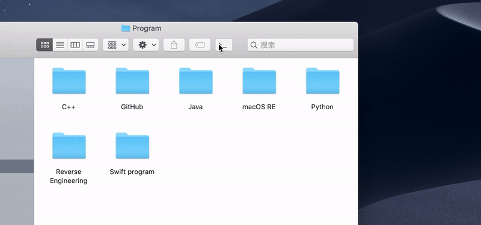
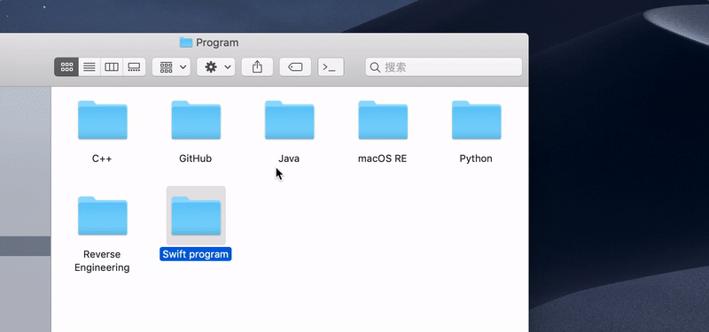
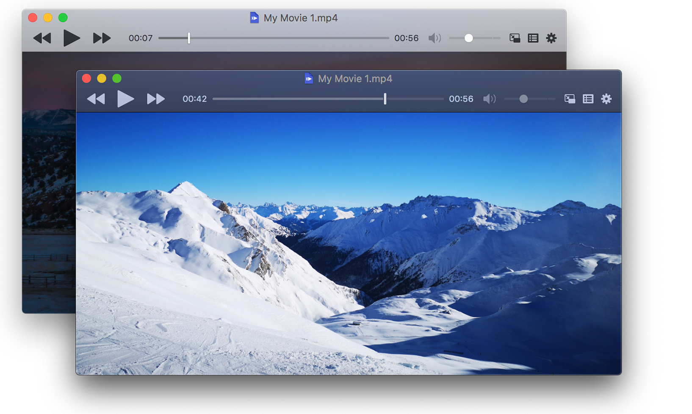
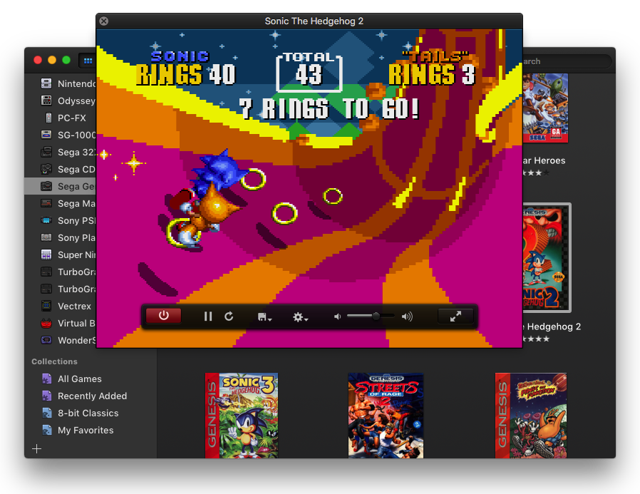

作者： [LeanCloud weakish](https://mmap.page/)

安利 6 款热门的 macOS 应用，其中包括三个提高效率的小工具（把 Dock 放到 TouchBar 上、在终端打开当前文件夹、基于 Lua 自动化重复任务），航拍屏保，媒体播放器，古代游戏模拟器。这些应用都是开源的（使用 Swift 和 Objective C 编写），不仅可以免费获得，还有源代码可供观摩借鉴。

## Pock

想要最大化屏幕空间利用但又不喜欢自动隐藏 Dock？试试 Pock，把 Dock 放到 TouchBar 上。很久以前 macOS 就把应用程序的菜单栏放到顶部状态栏，现在 Pock 把 Dock 放到 TouBar 上，是不是挺对称的？Pock 会保留应用图标的小红点，这样你就不会错过重要的通知信息。Esc、亮度、音量、播放之类的常用功能键也都还在，用起来很方便。


<https://pock.pigigaldi.com/>

## OpenInTerminal

只需一次点击，便可在终端中打开文件管理器的当前文件夹或选中的文件夹。





初次使用时需要选择终端应用（支持 Terminal、iTerm、Hyper、Alacritty），部分终端应用支持选择打开新标签页或新窗口。

<https://github.com/Ji4n1ng/OpenInTerminal>

## Hammerspoon

macOS 自带的 Automator 可以让你通过编写 AppleScript 自动化重复任务。不过，如果你用不惯 AppleScript 的话，可以试试 Hammerspoon，基于 Lua 自动化重复任务。其实 Lua 也和大多数主流编程语言不大一样，不过总比 AppleScript 正常多了。

例如，下面一段代码实现了到达咖啡馆后（通过 WiFi SSID 识别）发消息召唤小伙伴的功能。

```lua
coffeeShopWifi = "Baristartisan_Guest"
lastSSID = hs.wifi.currentNetwork()
wifiWatcher = nil

function ssidChanged()
    newSSID = hs.wifi.currentNetwork()

    if newSSID == coffeeShopWifi and lastSSID ~= coffeeShopWifi then
        -- We have arrived at the coffee shop
        hs.messages.iMessage("iphonefriend@hipstermail.com", "Hey! I'm at Baristartisan's, come join me!")
        hs.messages.SMS("+1234567890", "Hey, you don't have an iPhone, but you should still come for a coffee")
    end
end

wifiWatcher = hs.wifi.watcher.new(ssidChanged)
wifiWatcher:start()
```

<http://www.hammerspoon.org/>

## Aerial

Apple TV 的新版屏保取自 Apple 制作的航拍视频。Aerial 让你在 macOS 上方便地使用这些精美的屏保，拉斯维加斯、旧金山、夏威夷、中国等地的美妙风光尽收眼底。


注意，安装 Aerial 后，需要在系统设置屏保中选择 Aerial。Aerial 会从苹果官网下载屏保资源。由于文件较大，若网速不佳，请耐心等待。

<https://github.com/JohnCoates/Aerial>

## IINA

功能强大的媒体播放器，提供 Mojava 深色模式适配，支持画中画、音乐模式，鼠标、触摸板手势。IINA 基于 mpv 开发，因此支持几乎所有的媒体文件格式，高级用户也可以利用 mpv 配置文件、脚本系统满足特殊需求。



<https://iina.io>

## OpenEmu

闲暇时分，可以考虑在 macOS 上用 OpenEmu 玩一把古代游戏。它支持雅达利、Game Boy、GBA、Nintendo DS、PSP 等多种模拟器引擎。




<https://github.com/OpenEmu/OpenEmu>

## 更多

其实 macOS 上有大量优秀的开源应用，Serhii Londar 等一百多位热心人士在 GitHub 上整理了一份列表 [serhii-londar/open-source-mac-os-apps]，有空可以去里面挑一挑，看看有没有钟意的。

[serhii-londar/open-source-mac-os-apps]: https://github.com/serhii-londar/open-source-mac-os-apps


题图： [Willian Justen de Vasconcellos](https://unsplash.com/photos/hPcF0UCpNhs)
