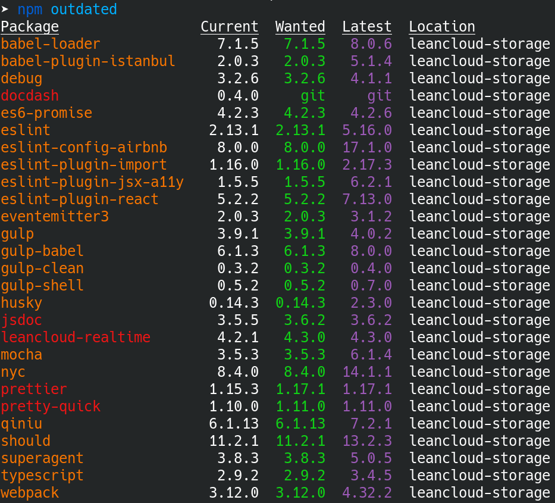

作者： [LeanCloud weakish](https://mmap.page/)

绝大多数前端和 Node.js 开发者每天的日常工作都离不开 npm，不知道你对 npm 的观感如何？如果你觉得 npm 很棒，那么不妨看下这篇文章，说不定其中有你之前没留意过的小窍门，可以让你 npm 用得更顺手。如果你觉得 npm 很糟糕，那也可以看下这篇文章，也许会发现用上一些小技巧，npm 会变得稍微不那么糟糕。


## npm ci

别被它的名字骗了。`npm ci` 并不仅仅适用于持续集成系统，在日常开发中，`npm ci` 非常实用。和 `npm install` 不同，`npm ci` 根据 `package-lock.json` 安装依赖，这可以保证整个开发团队都使用版本完全一致的依赖，避免把时间浪费在排查因为依赖不一致而导致的各种奇怪问题上。不仅如此，`npm ci` 还有一个很好的副作用，加快 node 模块安装速度。因为 `npm ci` 直接根据 `package-lock.json` 中指定的版本安装，无需计算求解依赖满足问题，在大多数情况下都可以大大加速 node 模块安装过程。如果你曾经因为嫌 `npm install` 太慢而换用兼容性不那么好的 yarn 以及兼容性更不好的 pnpm，那么不妨试下 `npm ci`，也许你会发现，其实 npm 也可以不那么慢。

另外，如果 `package-lock.json` 过时（和 `package.json` 冲突），那么 `npm ci` 会很贴心地报错，避免项目依赖陷入过时状态。

有了 `npm ci`，基本上我只在引入新依赖时才使用 `npm install`。

注意，`npm ci` 在安装前会自动清除现存的 `node_modules`，所以 `npm ci` 天然规避了增量安装可能带来的不一致性等问题。（这也意味着，你又可以少记一条命令 `npm prune`。）不过，如果你的网络很慢，那可能就不那么妙了。别慌，你可以用 `--prefer-offline`，最大限度地利用 npm 的全局缓存加速安装过程。

当然，既然使用 `npm ci`，那就别忘了把 `package-lock.json` 加入 git 仓库。

## npm outdated

`npm ci` 基于 `package-lock.json` 锁定依赖版本，确保项目开发环境的一致性。但这并不意味着依赖版本是锁死的。为了利用新版本带来的问题修复、新特性以及性能提升，定期还是需要升级依赖版本的。在这一场景下，推荐使用 `npm outdated`。它会列出还没有升到当前最新版本的项目依赖。红色表示符合指定的语义化版本范围，理论上可以无脑升级（`npm update` 会一次性升级所有红色依赖）。黄色表示不符合指定的语义化版本范围，比如大版本升级，升级可能会遇到兼容性问题。



有些项目处于维护阶段，不打算加新特性了，甚至可能不太严重的问题都不打算修复了，但是像安全漏洞这样的严重问题还是要管的。这时可以使用 `npm audit` 命令，列出项目依赖中有安全漏洞的版本。处于活跃开发阶段的项目当然也需要关注安全漏洞问题，但是因为 `npm install` 引入新依赖时会自动运行 `npm audit`，再加上会定期运行 `npm outdated`，所以手动运行 `npm audit` 的机会不太多。

## npx

前面说过基本上只在引入新依赖时才使用 `npm install`，没有提到全局安装。全局安装当然也需要使用 `npm install`。不过，为了确保开发环境的一致性，`npm install --global` 应当慎用。个人建议仅仅在安装一些日常使用的工具时才使用全局安装，而项目开发所需的工具，则作为开发依赖安装，然后使用 `npx` 调用。

不推荐：

```sh
npm install --global webpack
webpack ...
```

推荐：

```sh
npm install --save-dev webpack
npx webpack ...
```

对于一些一次性的临时任务，可以直接通过 npx 运行相应工具，免去了手动安装的麻烦，也不会污染 `devDependencies`。

例如，之前项目使用 webpack 打包，现在想临时试下换用 rollup 打包的效果：

```sh
npx rollup ...
```

npx 很智能，如果路径中找不到 rollup，会自动安装。

npx 用来测试不同版本的兼容性时非常好用。下面是一些例子。

需要用到的 `cowsay` 的某个特性或修复已经合入 GitHub 主线，但是还没在 npmjs 上发新版，试一下：

```sh
npx github:piuccio/cowsay
```

临时测下内部维护的 `cowsay` 的一个分支：

```sh
npx git+ssh://my.hosted.git:cowsay.git#semver:^1
```

当前使用的是 node 的 LTS 版本（10），想试下 node 12 下构建脚本能不能跑起来：

```sh
npx -p node@12 npm run build
```

从上面我们可以看到，当包名和命令名不同时（`npm` 命令由 `node` 提供），可以用 `-p` 选项指定包名。

## npm run

在 `package.json` 的 `scripts` 属性中加入命令（例如：`"foo": "echo foo"`）就可以通过 `npm run foo` 运行对应命令。这是 npm 提供的一个很方便的运行项目相关的自动化任务的机制，有一点类似 `make`。不过直接运行 `make` （不带任何参数）会运行默认任务，但直接运行 `npm run` （不带任何参数）会列出所有在 `scripts` 中声明的命令。

```
; npm run
Lifecycle scripts included in leancloud-realtime:
  test
    npm run lint && npm run build && npm run docs && npm run test:node && npm run test:browser

available via `npm run-script`:
  precommit
    pretty-quick --staged
  commitmsg
    commitlint -e $GIT_PARAMS
  lint
    eslint --ignore-path .gitignore src test plugins && tsc realtime.d.ts --strict
  ...
```

## 其他

这里还有一些我个人觉得不是特别实用的小窍门，不过，每个人的需求和偏好不同，说不定你会觉得它们挺有用的。如果你有想要分享的窍门，欢迎留言。

- `npm init -y` 默认情况下，`npm init` 会让你回答一些问题。`npm init -y` 可以跳过这些问题，直接上手开发。我之所以不推荐它，是因为，如果你打算尽快上手开发一个应用，绝大多数情况下会用框架，而几乎所有框架在 npmjs 上都至少有一个 `create-xxx-app` 包。所以基本上你没有机会输入 `npm init` 去回答那些问题。而如果你打算写一个组件或库，那么 `package.json` 中的元信息对组件或库的使用者很重要（即使是仅供你自己使用的组件或库，未来的你也未必记得当初写这个组件或库的上下文），跳过这些问题并不是一个好主意。当然，急躁是程序员的三大美德，你也许会想，我可以在完成开发后再来补这些。但是，一般来说，往往项目开始的时候是你最有兴趣（或者说，稍微不那么反感）记录这些上下文的时刻。如果在项目开始的时候都不耐烦做这个，开发完成后，很可能就更没兴趣了。同理，README 也应该在项目开始前写。
- `npm repo` 可以打开项目的源代码仓库（大部分情况下是 GitHub），它还有一个姊妹命令，`npm home`，可以打开项目的主页。不过，我个人觉得，比起这两个命令，通常而言， IDE 或者编辑器的智能提示（速览类型、速览文档、速览定义之类）更高效。
- `.npmignore` 文件可以列出不想打包的文件，避免把一些无关的文件发布到 npmjs 上。但是，统一使用 `.gitignore` 可以满足绝大部分场景下的需求。而且，只存在 `.gitignore` 的情况下，`npm publish` 会尊重 `.gitignore` 的声明，而 `.npmignore` 和 `.gitignore` 同时存在的情况下，`npm publish` 会忽略 `.gitignore`，而不是取两者的并集。换言之，`.gitignore` 中忽略但 `.npmignore` 中未忽略的文件会被打包发布。所以，使用 `.npmginore` 就意味着需要同时小心翼翼地维护两份大部分内容重复的列表。同时，一旦团队中有任何一人因为偶然的疏忽或者不熟悉 `.npmignore` 和 `.gitignore` 关系的细节出现了失误，那就有可能将敏感信息发布到 npmjs 上，导致安全事故。
- 各种 npm 命令的快捷版本，比如用 `npm i -D` 代替 `npm install --save-dev`。这些个人觉得不用专门刻意去记。经常输入的命令，可以 `npm help` 一下看看有没有简短版本。不查也没有关系，`npm t` 和 `npm test` 乃至 `npm run test` 的区别绝不是开发效率的瓶颈所在。很多时候这只是个人偏好问题，比如追求尽可能少打字的人会喜欢 `npm t`，追求尽可能少记东西的人会喜欢 `npm run test` （永远不会因为误以为 `npm build` 表示 `npm run build` 而碰到问题），其他人可能会喜欢 `npm test` 这样中庸的选项。
- `npm xmas` 猜猜输入这个命令会得到什么结果？你可以亲自试一下。提示：这个命令完全没有实用性可言。;-)

题图：[Rubén Bagüés](https://unsplash.com/photos/ZzApzgh5lxo)