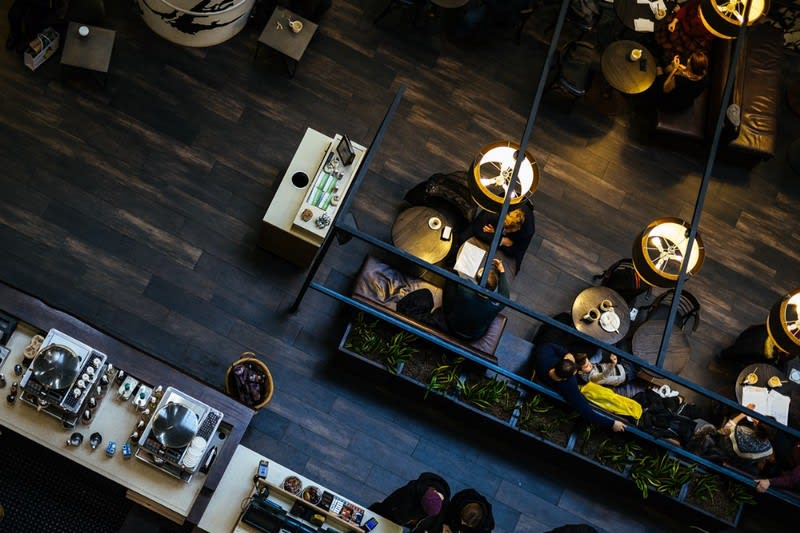
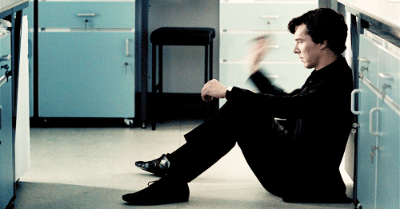
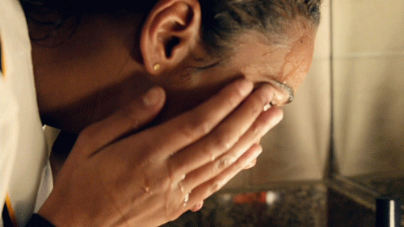
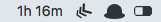
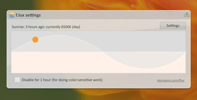

[Sarthak Sharma] 原作，授权 [New Frontend](https://nextfe.com/) 翻译。

[Sarthak Sharma]: https://dev.to/sarthology/the-definitive-guide-to-protecting-your-eyes-for-developers-22jm

大概两年前的这个时候，我曾不分昼夜地和我的团队一起做一个产品。那时我们会一天看屏幕超过 12 个小时。回想起来，这段经历十分刺激，不过作为年轻人，我们常常为了寻求刺激而忽视了健康。像黑客马拉松这样的活动必然是非常刺激的，但很少有人意识到连续盯着屏幕那么长时间会对眼睛造成伤害。果然，我们中的两个人没过几周就都戴上了眼镜。

现实给我们上了难忘的一课。

其实当我刚发现自己视力退化的时候，我崩溃了很长一段时间，与此同时拼命地寻求各种保护眼睛的方法并尝试改变自己的生活习惯。后来我的视力居然恢复了一些，而且不用一直戴着眼镜了。好开心！

现在我要把这段大开「眼」界的经历分享给你。

## 改造你的工作环境

这通常是最容易被忽视的因素，所以我要先来说说它。我们都知道要如何调节显示器来让眼睛感到舒适，这里就不多说了，不过如果你想了解更多的话，可以看[这里](https://www.theatlantic.com/health/archive/2012/09/how-to-keep-computer-screens-from-destroying-your-eyes/263005/)。除此之外，最重要的一点就是光线。试着把显示器摆在不正对窗户的位置，这样可以避免反光。如果你需要开灯，尽量用顶灯，但不要让它太亮，不然你的眼睛会受不了。我个人比较倾向于暖光而非白光。

## 做些简单的运动

你可能听说过著名的「20–20–20 法则」，大概是这样说的：

> 「每隔 20 分钟，往 20 英尺（译注：约 6 米）以外的地方看至少 20 秒。」

也许你的医生会告诉你去这样做，而且这的确有一定的效果，当然前提是你知道 20 英尺有多长，并且你不会因此感到无聊。不过坦率地讲，这对我和很多其他人都没有什么效果，至少我试过后痛苦地失败了。于是我后来改做一些简单有趣的运动，这些运动同样会对你有帮助。

**往墙上扔球**

就像它听起来的那么简单，你只需拿起一个海绵球（这样破坏力小一些）往墙上扔就可以了。在扔的时候注意盯住你的球，这样你的眼睛就可以跟随它往各个方向看一看。整个过程特别令人放松，几乎有一种冥想的感觉。除此之外，玩飞镖也能达到同样的效果。

**来场水疗**

每次去洗手间的时候，你都可以往脸上泼点儿水清洁一下你的眼睛，同时给眼部来个微型按摩。这不仅可以帮助你放松眼睛，还能去除干涩的感觉。注意不要在干燥的情况下直接按摩，不然会损伤你的眼睛。下次有机会记得试一下，你会回来感谢我的。

## 试试这些应用

不聊应用的程序员不是好程序员。这儿有几个应用能帮助你直接或间接地保护视力。

*Aware/Awareness*

[Aware](https://awaremac.com/) 可以在 Mac 的菜单栏显示你连续使用电脑的时间，这样你就总会对此有所感知（就像它的名字一样），然后每隔一段时间就会想去放松一下你的眼睛（还有身体）。

[Awareness](http://iamfutureproof.com/tools/awareness/#) 的功能和它差不多，不过多了个 Windows 版。

*f.lux*

f.lux 是个十分流行的减少屏幕蓝光的软件，可以根据当前时间自动调整屏幕色彩。假设你在日落后继续接收大量蓝光，不仅会扰乱睡眠（你的大脑会以为那依然是白天），还对眼睛不利。有了 f.lux，这些都不再是问题。除非你是个特别在意色彩还原度的设计师，这款软件还是很有帮助的。

*程序员们，如果你有任何关于护眼应用的 idea 并且想找人一起做的话，可以在 [Twitter](https://twitter.com/Sarthology) 上私信联系我。*

## 吃的也很重要

妈妈总是告诉我吃什么就会变成什么，这句话放在这里同样适用。想保护眼睛的话，你需要在饮食上做出一些改变。

最重要的就是多喝水。如果你脱水过久，你的眼睛会感到干涩甚至是酸痛。每天喝两至三升水不仅能帮助你保护眼睛，还能保持整个身体的健康。另外要多吃下面提到的这些食物，它们不仅能提升你的视力，还有可能让你像我一样摘掉眼镜。

- 菠菜
- 羽衣甘蓝
- 柚子
- 草莓
- 孢子甘蓝
- 橙子
- 杏仁
- 葵花籽

除此之外，多吃绿色蔬菜和富含蛋白质的食物也对提升视力有作用，亲测有效。

## 少！用！手！机！

我知道工作很重要，但手机在很多情况下会比电脑造成更多的视力损伤。你可能已经习惯躺在床上盯着手机看好几个小时，但以后别再这样了。就像前面提到的那样，手机屏幕发出的蓝光也会让你的身体以为那是白天，进而扰乱你的睡眠。所以尽量只在必要的时候使用手机，尤其是晚上的时候。如果一定要用的话，可以打开蓝光过滤器，很多新款手机都自带这项功能。

## 结语

建议每个月去测测视力，这样你就清楚自己新的生活习惯是否对其有提升效果。另外要及时更换合适的镜片，因为错误的度数可能让你的视力更糟糕。最后，即使你的视力已经完全恢复，也要养成戴防蓝光眼镜的习惯。你的眼睛是你身上最宝贵的财产，你当然不想失去它们。前面提到的这些习惯并不会占用你太多时间，但绝对能让你终身受益，毕竟预防总比治疗要好。

如果我忘了提到什么东西，可以在下面留言告诉我。如果你喜欢这篇文章，可以把它分享给你的朋友，让他们也学会保护眼睛。

欢迎关注我的 [Medium](https://medium.com/@Sarthaksharma0)。

Image by knirps07 from Pixabay
