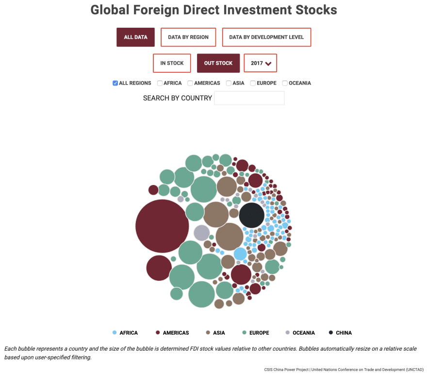
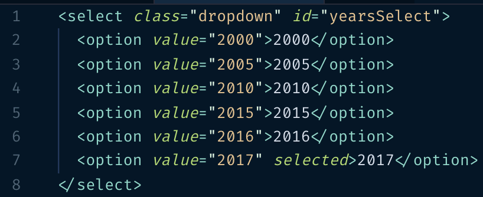

[Jacque Schrag] 原作，授权 [New Frontend](https://nextfe.com/) 翻译。

[Jacque Schrag]: https://dev.to/jnschrag/refactoring-the-worst-code-i-ve-ever-written-42c7

在 [#DevDiscuss] 聊“开发者忏悔”这个话题时，我承认 3 年前开始我的第一份开发工作时，根本不知道自己在做什么。题图中的代码是一个例子，展示了我当时是如何写代码的。

[#DevDiscuss]: https://twitter.com/search?q=%23DevDiscuss

我收到太多分享类似经历的回应。我们中的大多数人都写过让自己羞愧的糟糕代码（硬写一些愚蠢代码，虽然可以完成任务所需，但本可以写得更高效）。但是当我们回顾过去的代码时，如果能意识到我们可以如何写得更好，乃至觉得当初做的选择很可笑，那么这是一个成长的标志。秉承持续学习的精神，我想要分享一些现在的我会怎么来写这段代码的方式。

## 上下文和目标

在重构任何陈年代码之前，评估当初写代码时的上下文是极为关键的一步。开发者当初做的某个<s>疯狂</s>决策背后可能有一个重要的原因，源自你不了解的上下文（或者源自你不记得的上下文，如果代码是你写的）。我的这个例子，则单纯是因为缺乏经验，所以我可以安全地重构代码。

这段代码是为两张数据可视化图表写的。它们的数据和功能相似，主要目标是让用户可以根据类型、年份、区域过滤查看数据集。



我们假定改变过滤器会返回以下数值：

```js
let currentType = 'in' // 或 'out'
let currentYear = 2017
let currentRegions = ['Africa', 'Americas', 'Asia', 'Europe', 'Oceania']
```

最后，下面是一个从 CSV 加载数据的简化例子：

```js
const data = [
  { country: "Name", type: "in", value: 100, region: "Asia", year: 2000 },
  { country: "Name", type: "out", value: 200, region: "Asia", year: 2000 },
  ...
]
// 数组中总共约有 2400 条数据
```

## 选项一：初始化空对象

除了硬编码之外，我原本的代码完全违反了 DRY 原则。当然有些情况下重复是有意义的，但在这个不断重复同样属性的情况下，动态创建对象是更明智的选择。这还可以降低数据集新增年份的工作量，同时降低输入错误的风险。

这里有好几种选择：`for`、`.forEach`、`.reduce`。我将使用 `.reduce` 方法处理数组，将数组转化为其他东西（在我们的例子中是对象）。我们使用三次 `.reduce`，每个类别一次。

我们首先声明类别常量。这样未来我们只需在 `years` 数组中加上新的年份，我们将要编写的代码会处理剩下的部分。

```js
const types = ['in', 'out']
const years = [2000, 2005, 2010, 2015, 2016, 2017]
const regions = ['Africa', 'Americas', 'Asia', 'Europe', 'Oceania']
```

我们想要逆转 types → years → regions 的顺序，从 regions 开始。一旦 `regions` 转换为对象，就可以将它赋值给 years 属性。years 和 types 同理。尽管我们可以少写几行代码，但我选择更清晰而不是更聪明的写法。

```js
const types = ['in', 'out']
const years = [2000, 2005, 2010, 2015, 2016, 2017]
const regions = ['Africa', 'Americas', 'Asia', 'Europe', 'Oceania']

// 将 regions 转换为对象，每个 region 是一个属性，值为一个空数组。
const regionsObj = regions.reduce((acc, region) => {
  acc[region] = []
  return acc
}, {}) // 累加器（`acc`）的初始值设为 `{}`

console.log(regionsObj)
// {Africa: [], Americas: [], Asia: [], Europe: [], Oceania: []}
```

既然已经有了区域对象，年份和类型也可以照此处理。只不过它们的值不是像区域一样设为空数组，而是之前说的类别对象。

```js
function copyObj(obj) {
  return JSON.parse(JSON.stringify(obj))
}

// 和 regions 一样处理 years，但将每个年份的值设为 region 对象。
const yearsObj = years.reduce((acc, year) => {
  acc[year] = copyObj(regionsObj)
  return acc
}, {})

// type 也一样。返回最终对象。
const dataset = types.reduce((acc, type) => {
  acc[type] = copyObj(yearsObj)
  return acc
}, {}

console.log(dataset)
// {
//  in: {2000: {Africa: [], Americas: [],...}, ...},
//  out: {2000: {Africa: [], Americas: [], ...}, ...}
// }
```

我们现在得到的效果和我最初的代码是一致的，然而我们成功地将它重构成可读性更强、更容易重构的代码！需要在数据集中新增年份时再也不需要复制粘贴了！

不过还有一个问题：我们仍然需要手工更新年份列表。而且既然我们将在对象中加载数据，没理由单独初始化一个空对象。下面的两个重构选项完全脱离了我最早的代码，展示了如何直接使用数据。

附注：老实说，如果我在 3 年前尝试重构，我大概会用 3 层嵌套的 `for` 循环，并对此表示满意。就像 [Stephen Holdaway] 在评论中给出的写法：

[Stephen Holdaway]: https://dev.to/stecman/comment/a9oj

```js
const types = ['in', 'out'];
const years = [2000, 2005, 2010, 2015, 2016, 2017];
const regions = ['Africa', 'Americas', 'Asia', 'Europe', 'Oceania'];

var dataset = {};

for (let typ of types) {
  dataset[typ] = {};
  for (let year of years) {
    dataset[typ][year] = {};
    for (let region of regions) {
      dataset[typ][year][region] = [];
    }
  }
}

```

我之前使用 `reduce` 的写法避免了过深的嵌套。

## 选项二：直接过滤

有些读者大概想知道为什么我们要把数据按类型分组。我们本可以使用 `.filter` 根据 `currentType`（当前类型）、`currentYear`（当前年份）、`currentRegion`（当前区域） 返回所需数据，就像这样：

```js
/*
  `.filter` 会创建一个新数组，其中所有的成员均匹配 `currentType` 和 `currentYear`。
  `includes` 根据 `currentRegions` 是否包含条目的 region 返回真假。
*/
let currentData = data.filter(d => d.type === currentType && d.year === currentYear && currentRegion.includes(d.region))
```

尽管这一行代码效果不错，但我不建议在我们的例子中使用它，原因有两个：

1. 用户每次选择筛选条件都会运行该方法。取决于数据集的大小（别忘了数据集将随着年份增长），这可能影响性能。现代浏览器很高效，性能损失也许极小，但如果我们明知用户每次只能选择一种类型和一个年份，我们可以在一开始就分组数据，主动提升性能。
2. 这一选项不会提供可供选择的类型、年份、区域列表。有了这些列表，我们可以使用它们动态生成用户界面的骨架，无需手动创建并更新。



没错，我当年硬编码了选项。每次新增一个年份，我需要记住同时更新 JS 和 HTML。

## 选项三：由数据驱动的对象

我们可以将前两个选项组合一下，得到第三种重构方式。这种方式的目标是在更新数据集时完全不需要修改代码，直接根据数据确定类别。

同样，要做到这一点，技术上有多种方法。不过，我将继续使用 `.reduce`。

```js
const dataset = data.reduce((acc, curr) => {
  // 如果累加器的属性中已存在当前类型，将其设为自身，否则初始化为空对象。
  acc[curr.type] = acc[curr.type] || {}
  // 年份同理
  acc[curr.type][curr.year] = acc[curr.type][curr.year] || []
  acc[curr.type][curr.year].push(curr)
  return acc
}, {})
```

注意上面的代码中不包括区域。这是因为，和类型、年份不同，可以同时选中多个区域。这使得预先根据区域分组毫无作用，要是这么做了，我们还得合并它们。

考虑到这一点，下面是新版的根据选定类型、年份、区域获取 `currentData` 的一行代码。由于我们将数据的查找范围限定于当前类型和当前年份，我们知道数组中数据项数目的最大值等于国家数（小于 200），这就比选项二中的 `.filter` 实现要高效很多。

```js
let currentData = dataset[currentType][currentYear].filter(d => currentRegions.includes(d.region))
```

最后一步是获取不同类型、年份、区域的数组。为此我将使用 `.map` 和集合。下面是一个例子，获取一个数组，包含数据中所有不同区域。

```js
// `.map` 将提取特定对象属性值（例如，区域）到新数组
let regions = data.map(d => d.region)

// 根据定义，集合中的值是唯一的。重复值将被剔除。
regions = new Set(regions)

// Array.from 根据集合创建数组。
regions = Array.from(regions)

// 单行版本
regions = Array.from(new Set(data.map(d => d.region)))

// 或者使用 ... 操作符
regions = [...new Set(data.map(d => d.region))]
```

使用同样的方法处理类型和年份。接着就可以根据数组的值动态创建过滤界面。

## 最终的重构代码

最终我们得到了如下的重构代码，未来数据集新增年份无需手工改动。

```js
// 类型、年份、区域
const types = Array.from(new Set(data.map(d => d.type)))
const years = Array.from(new Set(data.map(d => d.year)))
const regions = Array.from(new Set(data.map(d => d.region)))

// 根据类型和年份分组数据
const dataset = data.reduce((acc, curr) => {
  acc[curr.type] = acc[curr.type] || {}
  acc[curr.type][curr.year] = acc[curr.type][curr.year] || []
  acc[curr.type][curr.year].push(curr)
  return acc
}, {})

// 根据选中内容获取数据
let currentData = dataset[currentType][currentYear].filter(d => currentRegions.includes(d.region))
```

## 结语

调整格式仅仅是重构的一小部分，“重构代码”常常意味着重新构想实现和不同部分之间的关系。解决问题有多种方式，所以重构不容易。一旦找到有效的解决方案，可能不太容易去考虑不同做法。确定哪种解决方案更好并不总是显而易见的，可能很大程度上取决于代码的上下文，甚至，个人偏好。

想要更好地重构代码，我有一条简单的建议：阅读更多代码。如果你在团队里，积极参与代码审阅。如果有人让你重构代码，问下为什么并且尝试去理解其他人处理问题的方式。如果你单独工作（就像我刚开始工作时一样），留意同一问题的不同解决方案，同时搜寻最佳实践指南。我强烈推荐阅读 [Jason McCreary] 的 [BaseCode]，编写更简单、更可读代码的指南，其中包含很多真实世界的例子。

[Jason McCreary]: https://dev.to/gonedark
[BaseCode]: https://basecodefieldguide.com/

最重要的是，认可这一事实，有时你会写下糟糕的代码，重构（让它变得更好）是成长的标志，值得庆祝。